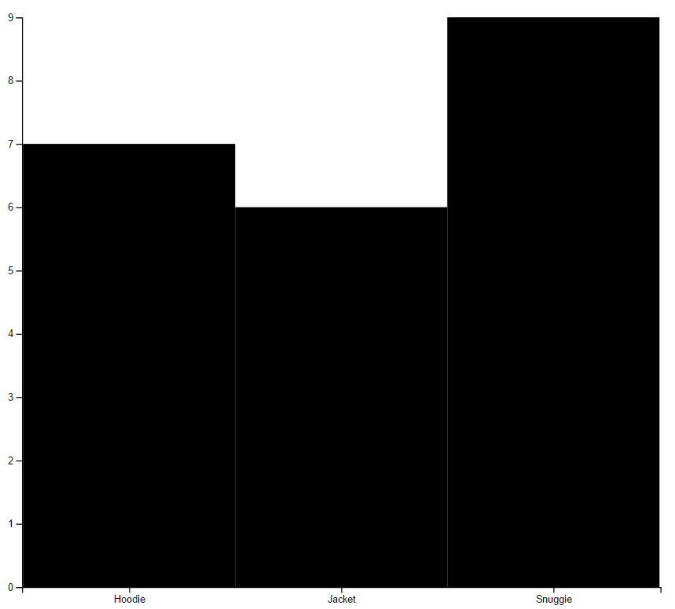

# 02 Charts / 02 BarChart

1) Add a padding between each of the chart bars.


2) What about adding some color to each bar, based on the product Id ?

Some tips:

- We can treat product category as an ordinal.

- We can create a function that returns a color based on 
an existing d3 SchemeCategory

```javascript
// helper that returns a color based on an ID
var barColor = d3.scaleOrdinal(d3.schemeCategory10);
```

The React it self has an attribute called filled, we can
attach to it a _function(d)_ extract from it the current product
and invoke the color function we have previously created.

3) Let's rotate 90º the bar chart, we want it to show it like:



If you need some help, a similar sample can be found: 

[Blocks Sample](http://bl.ocks.org/d3noob/8952219) 

# 02 Charts / 05 Lines

4) Add one more line to the chart, this line will represent
a set of expenses.


