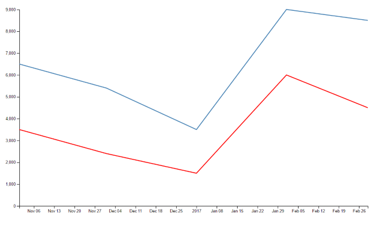
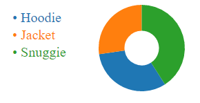

# 02 Charts / 02 BarChart

1) Add a padding between each of the chart bars.


**Solution**

```diff
newRects.append('rect')
  .attr('x', x(0))
  .attr('y', function(d, i) {
    return y(d.product);
  })
-  .attr('height', y.bandwidth)
+  .attr('height', function(d, i) {
+    return y.bandwidth() - 5;
+  })
  .attr('width', function(d, i) {
    return x(d.sales);
  });

```

2) What about adding some color to each bar, based on the product Id ?

Some tips:

- We can treat product category as an ordinal.

- We can create a function that returns a color based on 
an existing d3 SchemeCategory

```javascript
// helper that returns a color based on an ID
var barColor = d3.scaleOrdinal(d3.schemeCategory10);
```

The React it self has an attribute called filled, we can
attach to it a _function(d)_ extract from it the current product
and invoke the color function we have previously created.

**Solution**

```diff
+ // helper that returns a color based on an ID
+ var barColor = d3.scaleOrdinal(d3.schemeCategory10);


newRects.append('rect')
  .attr('x', x(0))
  .attr('y', function(d, i) {
    return y(d.product);
  })
  .attr('height', y.bandwidth)
  .attr('width', function(d, i) {
    return x(d.sales);
  })
+  .attr('fill', function(d) {
+    return barColor(d.product);
+  });
```

3) Let's rotate 90º the bar chart, we want it to show it like:


First let's swap X Scale and Y Scale


```javascript

let margin = null,
    width = null,
    height = null;

let svg = null;
let x, y = null; // scales

setupCanvasSize();
appendSvg("body");
setupXScale();
setupYScale();
appendXAxis();
appendYAxis();
appendChartBars();

// 1. let's start by selecting the SVG Node
function setupCanvasSize() {
  margin = {top: 100, left: 180, bottom: 120, right: 130};
  width = 960 - margin.left - margin.right;
  height = 800 - margin.top - margin.bottom;
}

function appendSvg(domElement) {
  svg = d3.select(domElement).append("svg")
              .attr("width", width + margin.left + margin.right)
              .attr("height", height + margin.top + margin.bottom)
              .append("g")
              .attr("transform",
              "translate(" + margin.left + "," + margin.top + ")");
              ;
}


function setupXScale()
{
  x = d3.scaleBand()
    .rangeRound([0, width])
    .domain(totalSales.map(function(d, i) {
      return d.product;
    }));

}

function setupYScale()
{
  var maxSales = d3.max(totalSales, function(d, i) {
    return d.sales;
  });

  y = d3.scaleLinear()
    .range([height,0])
    .domain([0, maxSales]);    
}

function appendXAxis() {
  // Add the X Axis
  svg.append("g")
    .attr("transform", "translate(0," + height + ")")
    .call(d3.axisBottom(x));
}

function appendYAxis() {
  //   
  // Add the Y Axis
  svg.append("g")   
 
  .call(d3.axisLeft(y));
}

function appendChartBars()
{
  // 2. Now let's select all the rectangles inside that svg
  // (right now is empty)
  var rects = svg.selectAll('rect')
    .data(totalSales);

    // Now it's time to append to the list of Rectangles we already have
    var newRects = rects.enter();


    newRects.append('rect')
      .attr('x', function(d, i) {
        return x(d.product);
      })
      .attr('y', function(d) { 
        return y(d.sales); 
      })     
      .attr('height', function(d, i) {
        return height - y(d.sales);
      })
      .attr('width', x.bandwidth)      
      ;
      
}
```

**There's a second solution that you can try... what about keeping the chart 
as it was original and just rotate it?**

# 02 Charts / 05 Lines

4) Add one more line to the chart, this line will represent
a set of expenses.



Let's start by adding a new style for the new line (styles.css)

```css
.lineB {
fill: none;
stroke: red;
stroke-width: 2px;
}
```

We will add a new line of data

```javascript
var totalExpenses = [
{ month: new Date(2016,10, 01), sales: 3500 },
{ month: new Date(2016,11, 01), sales: 2400 },
{ month: new Date(2016,12, 01), sales: 1500 },
{ month: new Date(2017,1, 01), sales: 6000 },
{ month: new Date(2017,2, 01), sales: 4500 },
];
```

> For the sake of simplicity we will keep the same dates (as an additional excercise, what should
you take care if we have different date ranges? we should combine min and max for the X timeline).

Next step let's add the new line

```javascript
function appendLineCharts()
{
  // (...)
  var expenseline = d3.line()
                    .x(function(d) { return x(d.month); })
                    .y(function(d) { return y(d.expense); });

  // Add the valueline path.
  svg.append("path")
  .data([totalExpenses])
  .attr("class", "lineB")
  .attr("d", expenseline);
}
```

# 02 Charts / 06 Pie

4) Create a Doughnut like chart.



You only need to play with the innerRadius property:

```javascript
  // Pie chart size
  var arc = d3.arc()
    .innerRadius(20)
    .outerRadius(50);
```