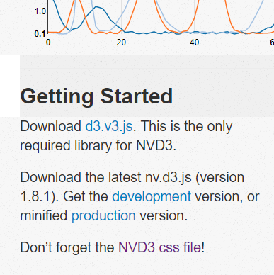
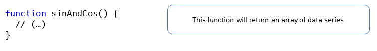
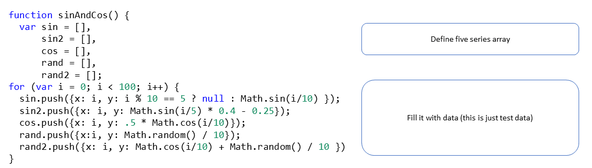
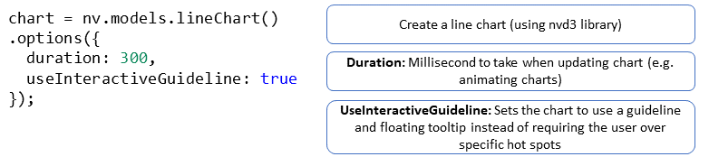
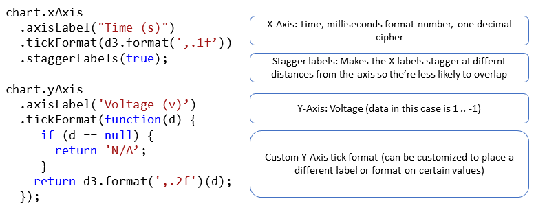

# Consuming third partie libraries

Let's get a quick start, sometimes we just need to deliver a chart and use it as a blackbox, we can just make use of an open source library, if
we are lucky and get exactly what we need can just use the chart as a black box.

In this case we will make use of _nvD3_ open source chart library:

http://nvd3.org/

# Steps to reproduce the sample

- Let's first create a simple index.html file:

```html
<!DOCTYPE html>
<html>
  <head>
    <meta charset="utf-8">
    <title></title>
  </head>
  <body>
    <h1>Sample Chart</h1>    
  </body>
</html>
```

- So far so good, we got a very basic HTML file working (double click on it and you will get some text displayed in your browser),
the next step is to reffer the nvd3 library, to make it simpler:
  - We are gong to link it via CDN (content delivery network).
  - We will import the library code + styles.

- ¿ Where I can get the links to this styles + library files? Right in the nvd3.org site:



```diff
  <body>
    <h1>Sample Chart</h1>    
  </body>
+  <link rel="stylesheet" href="https://cdnjs.cloudflare.com/ajax/libs/nvd3/1.8.5/nv.d3.min.css" />
+  <script src="https://cdnjs.cloudflare.com/ajax/libs/d3/3.5.2/d3.min.js" charset="utf-8"></script>
+  <script src="https://cdnjs.cloudflare.com/ajax/libs/nvd3/1.8.5/nv.d3.js"></script>
</html>
```

- The next step is to go to one of the samples, let's click on the "View More Samples" option in the main page,
and click on the _Simple Line Chart_ option.

- First we need to add the data, in this sample we are creating three series (lines) of data, just to create some random test data we are just generating values based on sine and cosine math funcions. Later on we will simplifiy this.

Let's first define this:

_data.js_

```javascript
function sinAndCos() {
    var sin = [],
        sin2 = [],
        cos = [],
        rand = [],
        rand2 = []
        ;
    for (var i = 0; i < 100; i++) {
        sin.push({x: i, y: i % 10 == 5 ? null : Math.sin(i/10) }); //the nulls are to show how defined works
        sin2.push({x: i, y: Math.sin(i/5) * 0.4 - 0.25});
        cos.push({x: i, y: .5 * Math.cos(i/10)});
        rand.push({x:i, y: Math.random() / 10});
        rand2.push({x: i, y: Math.cos(i/10) + Math.random() / 10 })
    }
    return [
        {
            area: true,
            values: sin,
            key: "Sine Wave",
            color: "#ff7f0e",
            strokeWidth: 4,
            classed: 'dashed'
        },
        {
            values: cos,
            key: "Cosine Wave",
            color: "#2ca02c"
        },
        {
            values: rand,
            key: "Random Points",
            color: "#2222ff"
        },
        {
            values: rand2,
            key: "Random Cosine",
            color: "#667711",
            strokeWidth: 3.5
        },
        {
            area: true,
            values: sin2,
            key: "Fill opacity",
            color: "#EF9CFB",
            fillOpacity: .1
        }
    ];
}
```

- Let's spend some time analyzing this file content.

Function:



Data generation:



Series generation (data + style):

")


And let's reference this new file into our index.html

_index.html_

```diff
  <body>
    <div id="chart1" style="height: 500px"></div>
  </body>
  <link rel="stylesheet" href="https://cdnjs.cloudflare.com/ajax/libs/nvd3/1.8.5/nv.d3.min.css" />
  <script src="https://cdnjs.cloudflare.com/ajax/libs/d3/3.5.2/d3.min.js" charset="utf-8"></script>
  <script src="https://cdnjs.cloudflare.com/ajax/libs/nvd3/1.8.5/nv.d3.js"></script>
+  <script src="./data.js"></script>
  <script src="./main.js"></script>
</html>
```

- Now it's time to instantiate the chart.

- First we will create a place holder where the chart will be displayed:

```diff
  <body>
    <h1>Sample Chart</h1> 
+   <div id="chart1" style="height: 500px"></div>      
  </body>
</html>
```

- Now we will add the chart instantiation, code below (we will break it down into pieces as we made with the data file).

_main.js_ 

```javascript
    // Wrapping in nv.addGraph allows for '0 timeout render', stores rendered charts in nv.graphs, and may do more in the future... it's NOT required
    var chart;
    var data;
    var legendPosition = "top";

    nv.addGraph(function() {
        chart = nv.models.lineChart()
            .options({
                duration: 300,
                useInteractiveGuideline: true
            })
        ;
        // chart sub-models (ie. xAxis, yAxis, etc) when accessed directly, return themselves, not the parent chart, so need to chain separately
        chart.xAxis
            .axisLabel("Time (s)")
            .tickFormat(d3.format(',.1f'))
            .staggerLabels(true)
        ;
        chart.yAxis
            .axisLabel('Voltage (v)')
            .tickFormat(function(d) {
                if (d == null) {
                    return 'N/A';
                }
                return d3.format(',.2f')(d);
            })
        ;
        data = sinAndCos();
        d3.select('#chart1').append('svg')
            .datum(data)
            .call(chart);
        nv.utils.windowResize(chart.update);
        return chart;
    });
```

And let's reference this new file into our index.html

_index.html_

```diff
  <body>
    <h1>Sample Chart</h1>
    <div id="chart1" style="height: 500px"></div>
    <link rel="stylesheet" href="https://cdnjs.cloudflare.com/ajax/libs/nvd3/1.8.5/nv.d3.min.css" />
    <script src="https://cdnjs.cloudflare.com/ajax/libs/d3/3.5.2/d3.min.js" charset="utf-8"></script>
    <script src="https://cdnjs.cloudflare.com/ajax/libs/nvd3/1.8.5/nv.d3.js"></script>
    <script src="./data.js"></script>
+   <script src="./main.js"></script>    
  </body>
</html>
```

- Let's chop the content of this file and try to understand it bit by bit.

Instantianting the chart



Setting up xAxis and YAxis



Instantiate the chart


> Excercise now is time to play with real data

http://api.population.io/


